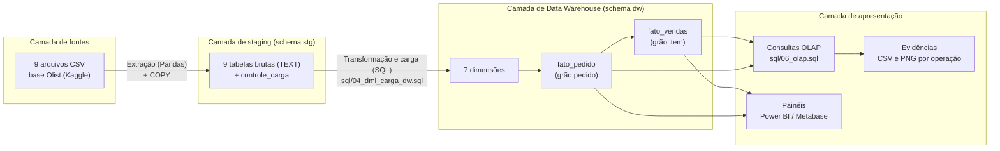
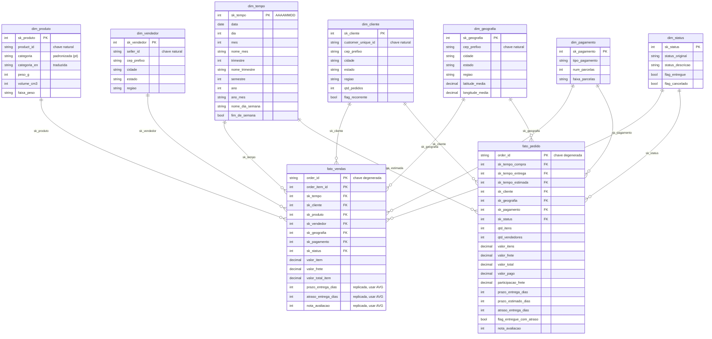
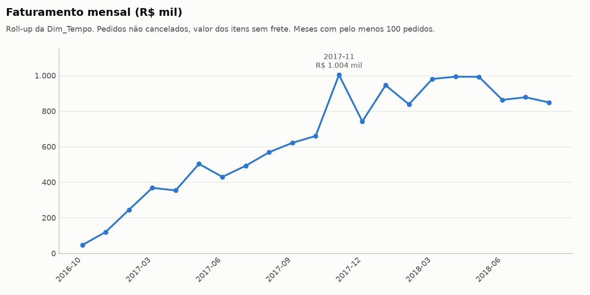
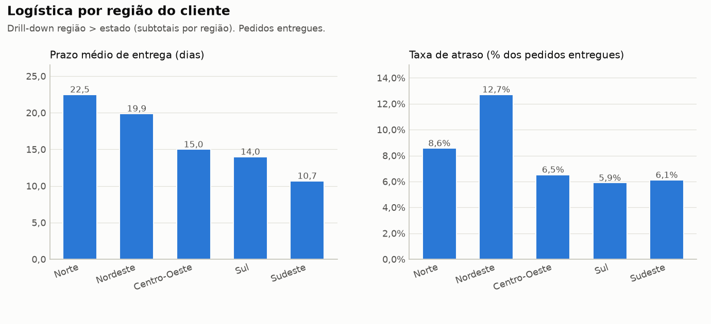
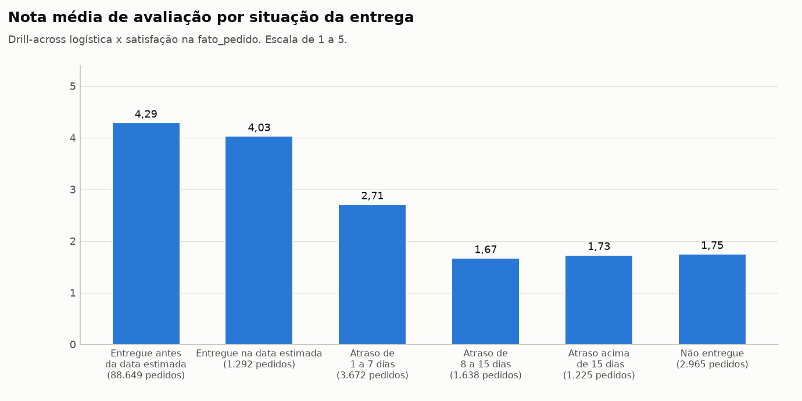
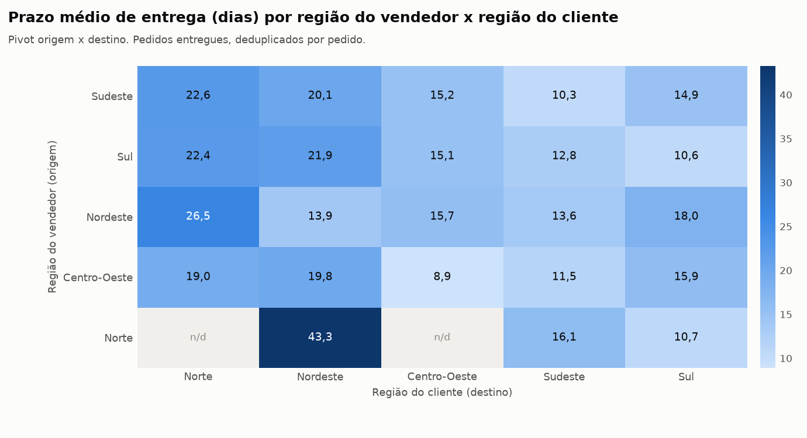

# Data Warehouse Olist. Análise de desempenho comercial e logístico em e-commerce

Projeto Integrador do quinto semestre do Curso Superior de Tecnologia em Banco de Dados (Senac São Paulo, 2026). **Segunda etapa, implantação da solução** planejada na primeira etapa (o relatório completo da etapa 1 está em [`docs/relatorio_etapa_1_planejamento.pdf`](docs/relatorio_etapa_1_planejamento.pdf)).

A solução carrega a base pública Olist (cerca de 100 mil pedidos de um marketplace brasileiro, 2016 a 2018) em um Data Warehouse PostgreSQL com modelo dimensional, por meio de um processo de ETL em SQL orquestrado em Python, e responde às questões de negócio da etapa 1 com operações OLAP (roll-up, drill-down, slice, dice, pivot, cube, ranking e drill-across), todas com evidências geradas a partir da execução real.

## Integrantes

| Integrante | GitHub | Frente principal (Quadro 7 da etapa 1) |
|---|---|---|
| Gustavo Vieira de Araújo | [@GustavoVieiraDeAraujo](https://github.com/GustavoVieiraDeAraujo) | Modelagem dimensional |
| Katlyn de Jesus Zatta | [@KatlynZatta](https://github.com/KatlynZatta) | Documentação e revisão |
| Ricardo dos Santos Silva | [@Ricardo-DSS](https://github.com/Ricardo-DSS) | Construção dos painéis |
| Thomaz Durval Linaldi Pereira | [@ThomazLinaldi](https://github.com/ThomazLinaldi) | Fonte de dados e arquitetura |
| Wesley Canuto Lopes | [@wescanutolopes](https://github.com/wescanutolopes) | Desenvolvimento do ETL |

## Vídeo demonstrativo

**[PREENCHER link do vídeo de 1 minuto]** (item mandatório da entrega).

## Sumário

1. [O que foi entregue nesta etapa](#1-o-que-foi-entregue-nesta-etapa)
2. [Definição das tecnologias](#2-definição-das-tecnologias)
3. [Arquitetura da solução](#3-arquitetura-da-solução)
4. [Fonte de dados](#4-fonte-de-dados)
5. [Detalhamento técnico](#5-detalhamento-técnico)
6. [Como executar](#6-como-executar)
7. [Operações OLAP e evidências](#7-operações-olap-e-evidências)
8. [Resultados consolidados](#8-resultados-consolidados)
9. [Limitações e próximos passos](#9-limitações-e-próximos-passos)
10. [Referências](#10-referências)

## 1. O que foi entregue nesta etapa

| Item do enunciado | Onde está |
|---|---|
| Definição das tecnologias | Seção 2 deste README |
| Detalhamento técnico | Seções 3, 4 e 5 deste README e comentários dos scripts |
| Fonte de dados da extração (origem apontada) | Seção 4 deste README |
| Scripts DDL | [`sql/00_create_database.sql`](sql/00_create_database.sql), [`sql/01_ddl_staging.sql`](sql/01_ddl_staging.sql), [`sql/02_ddl_dw.sql`](sql/02_ddl_dw.sql) |
| Scripts DML (carga do ETL) | [`sql/03_dml_carga_staging.sql`](sql/03_dml_carga_staging.sql), [`sql/04_dml_carga_dw.sql`](sql/04_dml_carga_dw.sql), [`sql/05_validacao.sql`](sql/05_validacao.sql) |
| Operações OLAP | [`sql/06_olap.sql`](sql/06_olap.sql) (17 operações) |
| Evidências das operações OLAP | [`olap/csv/`](olap/csv/) (resultado bruto) e [`olap/graficos/`](olap/graficos/) (gráfico, quando faz sentido), um arquivo por operação |
| Orquestração do ETL | [`etl/run_etl.py`](etl/run_etl.py), [`etl/gerar_evidencias.py`](etl/gerar_evidencias.py), [`etl/baixar_dados.py`](etl/baixar_dados.py) |
| Execução com um único comando, sem setup local | [`docker-compose.yml`](docker-compose.yml) e [`Dockerfile`](Dockerfile) (seção 6) |

## 2. Definição das tecnologias

A etapa 1 propôs as ferramentas por camada (Quadro 1) deixando duas escolhas em aberto, a ferramenta de ETL (Python ou Pentaho) e a de visualização (Power BI ou Metabase). As decisões finais e as justificativas estão abaixo.

| Camada | Tecnologia | Versão usada | Papel na solução | Justificativa |
|---|---|---|---|---|
| Fonte de dados | Arquivos CSV (base Olist) | Kaggle, 9 arquivos | Dados de origem, lidos em carga única (full load) | Formato aberto, leitura simples, base pública e anonimizada |
| Extração | Python 3 com Pandas | Python 3.11, Pandas 2.x ou 3.x | Leitura dos CSV em lotes, conferência das colunas e contagem de registros por arquivo | Flexibilidade para inspecionar os arquivos e registrar o controle da extração |
| Carga do staging | PostgreSQL COPY (via `psycopg2` ou `\copy` do psql) | psycopg2 2.9 | Carga em bloco dos dados brutos no schema `stg` | Caminho mais rápido do PostgreSQL para carga em massa (1,55 milhão de linhas em poucos segundos) |
| Transformação e carga do DW | SQL no próprio PostgreSQL (abordagem ELT) | PostgreSQL 16 | Regras do Quadro 4 aplicadas com `INSERT ... SELECT`, CTEs, funções de janela e agregações | Transformações declarativas, versionáveis e auditáveis, executadas onde os dados estão. Elimina a dependência de ferramenta visual (Pentaho) e mantém os scripts DDL e DML como núcleo da entrega |
| Data Warehouse | PostgreSQL 16 | 16.x | Schemas `stg` (staging) e `dw` (modelo dimensional) | SGBD relacional robusto, gratuito, com suporte a `GROUP BY ROLLUP/CUBE`, `FILTER`, funções de janela e CTEs, que sustentam as operações OLAP |
| Orquestração | Python 3 (scripts em `etl/`) | 3.11 | Executa as etapas em ordem, imprime o progresso no console, valida e exporta evidências | Reprodutibilidade em um único comando |
| Evidências e gráficos | Python com Matplotlib | 3.x | Exporta o resultado de cada operação OLAP em CSV (`olap/csv`) e PNG (`olap/graficos`) | Evidências geradas a partir da execução real, sem edição manual |
| Visualização (painéis) | Power BI Desktop ou Metabase, conectados ao PostgreSQL | opcional | Painéis temáticos previstos na etapa 1 (seção 4.3) | Ambos leem o schema `dw` diretamente. A escolha não afeta o DW nem o ETL |
| Containerização | Docker e Docker Compose | Compose v2 | Sobe o PostgreSQL e executa o pipeline completo (`baixar_dados.py` + `run_etl.py`) em containers isolados | Quem clona o repositório roda tudo com `docker compose up --build`, sem instalar Python, PostgreSQL nem as dependências localmente |
| Versionamento | Git e GitHub | | Controle de versão, colaboração e publicação da entrega | Exigência do enunciado |

Ambiente em que a solução foi testada de ponta a ponta. Ubuntu 24.04, Docker 27 com Docker Compose v2, imagem `python:3.12-slim` (Pandas 3.0, psycopg2 2.9, Matplotlib 3.11) e `postgres:16-alpine`. Pipeline completo (download incluso) em cerca de 35 segundos dentro do container, banco final com 309 MB (212 MB de staging e 89 MB de DW). A mesma execução também foi validada localmente sem Docker (Python 3.12, PostgreSQL 16).

## 3. Arquitetura da solução

A arquitetura segue as quatro camadas definidas na etapa 1 (seção 2.2).



(O mesmo diagrama em imagem está em [`docs/arquitetura.png`](docs/arquitetura.png).)

## 4. Fonte de dados

**Origem.** Brazilian E-Commerce Public Dataset by Olist, publicado no Kaggle (https://www.kaggle.com/datasets/olistbr/brazilian-ecommerce) sob licença CC BY-NC-SA 4.0. Dados reais e anonimizados de pedidos feitos entre setembro de 2016 e outubro de 2018 em marketplaces brasileiros. Os mesmos nove arquivos, idênticos aos do Kaggle, também estão publicados pela própria Olist no GitHub (https://github.com/olist/work-at-olist-data/tree/master/datasets), e é dessa origem que o script `etl/baixar_dados.py` os obtém sem necessidade de login.

Os arquivos não são versionados neste repositório por causa do tamanho (cerca de 125 MB, ficam em `data/raw/`, listado no `.gitignore`). Rodando via Docker Compose (seção 6) eles são baixados automaticamente pelo container; sem Docker, o mesmo download é feito com `python etl/baixar_dados.py`. A volumetria carregada bate exatamente com a Tabela 1 da etapa 1 (verificação V01 de `sql/05_validacao.sql`).

| Arquivo | Registros carregados |
|---|---:|
| olist_orders_dataset.csv | 99.441 |
| olist_order_items_dataset.csv | 112.650 |
| olist_order_payments_dataset.csv | 103.886 |
| olist_order_reviews_dataset.csv | 99.224 |
| olist_customers_dataset.csv | 99.441 |
| olist_products_dataset.csv | 32.951 |
| olist_sellers_dataset.csv | 3.095 |
| olist_geolocation_dataset.csv | 1.000.163 |
| product_category_name_translation.csv | 71 |

## 5. Detalhamento técnico

### 5.1 Estrutura do repositório

```text
.
├── README.md                     este documento (único README do repositório)
├── Dockerfile                    imagem do ETL (Python 3.12 + dependências), usuário não-root
├── docker-compose.yml            sobe o PostgreSQL e roda o pipeline completo com um comando
├── .dockerignore
├── requirements.txt              dependências Python (para quem roda sem Docker)
├── .env.example                  modelo das variáveis de conexão (uso local, sem Docker)
├── data/
│   └── raw/                      os 9 CSV da base Olist (baixados automaticamente, não versionados)
├── docs/
│   ├── relatorio_etapa_1_planejamento.pdf
│   ├── enunciado_etapa_2.pdf
│   ├── avaliacao_etapa_2.png     tabela de rubricas da segunda etapa
│   ├── arquitetura.png           diagrama da seção 3 em imagem
│   └── modelo_dimensional.png    diagrama da seção 5.3 em imagem
├── sql/
│   ├── 00_create_database.sql    cria o banco dw_olist
│   ├── 01_ddl_staging.sql        DDL do schema stg (9 tabelas brutas + controle_carga)
│   ├── 02_ddl_dw.sql             DDL do schema dw (função de padronização, 7 dimensões, 2 fatos, índices)
│   ├── 03_dml_carga_staging.sql  DML de extração/carga do staging (\copy) para quem usa só o psql
│   ├── 04_dml_carga_dw.sql       DML de transformação e carga do DW (regras do Quadro 4)
│   ├── 05_validacao.sql          26 verificações pós-carga
│   └── 06_olap.sql               17 operações OLAP
├── etl/
│   ├── baixar_dados.py           download dos CSV
│   ├── run_etl.py                orquestrador (extração, carga, transformação, validação, evidências)
│   ├── gerar_evidencias.py       executa o 06_olap.sql e exporta CSV e gráficos
│   └── utilitarios.py            conexão, leitura dos blocos SQL, formatação, log (usado pelos três scripts acima)
└── olap/
    ├── csv/                      17 arquivos .csv, resultado bruto de cada operação OLAP
    └── graficos/                 12 arquivos .png, um por operação em que o gráfico ajuda na leitura
```

Imagens e dados ficam em pastas separadas dentro de `olap/` para facilitar a navegação. O contexto de negócio, a consulta SQL e o resultado em tabela de cada operação (que antes viravam um `.md` por operação) são impressos no console durante a execução, não gravados em arquivo — não é um item exigido pelo enunciado, e assim o repositório não tem nenhum `.md` além deste README.

### 5.2 Camada de staging (schema `stg`)

O staging é uma cópia fiel dos arquivos de origem. As nove tabelas têm exatamente as colunas dos CSV e **todas as colunas são `TEXT`**, para que nenhum dado seja rejeitado ou alterado na entrada. A conversão de tipos é uma regra de transformação (Quadro 4) e acontece só na carga do DW, o que permite inspecionar o dado bruto e reprocessar quantas vezes for preciso sem reler os arquivos.

A tabela `stg.controle_carga` registra, por arquivo, a quantidade de registros lidos e carregados, o horário e a situação, atendendo ao controle de extração previsto na seção 5.2 da etapa 1. Os índices de apoio às junções são criados só depois da carga, no início do `04_dml_carga_dw.sql`, para não penalizar o COPY.

### 5.3 Modelo dimensional (schema `dw`)

A etapa 1 deixou uma decisão em aberto (seção 5.5). Prazo de entrega, atraso e nota de avaliação existem no grão de pedido e não de item. A decisão desta etapa foi adotar um **esquema em constelação** com duas tabelas de fato compartilhando as mesmas dimensões.

* `fato_vendas`, grão **item de pedido** (112.650 linhas). Guarda as medidas aditivas de valor (item, frete e total) e as medidas do pedido replicadas de forma controlada (prazo, atraso e nota), que devem ser lidas com `AVG` e nunca com `SUM`. É a estrela principal, usada em toda análise que envolve produto, categoria ou vendedor.
* `fato_pedido`, grão **pedido** (99.441 linhas). Guarda a composição do pedido (itens, produtos distintos, vendedores), os valores, o pagamento, as medidas logísticas e a nota no grão natural. É a fonte dos KPIs de pedido (prazo médio, taxa de atraso, taxa de cancelamento, nota média), sem risco de dupla contagem.

As medidas replicadas em `fato_vendas` são copiadas de `fato_pedido` durante a carga, o que garante consistência entre as duas fatos (verificação V03.7).



(O mesmo diagrama em imagem está em [`docs/modelo_dimensional.png`](docs/modelo_dimensional.png). A `dim_vendedor` também se liga à `fato_pedido` de forma indireta, pela `fato_vendas`, já que um pedido pode ter mais de um vendedor.)

Detalhes de cada dimensão (o Quadro 6 da etapa 1 foi integralmente implementado, com alguns atributos a mais).

| Dimensão | Grão e chave natural | Registros | Decisões de implementação |
|---|---|---:|---|
| `dim_tempo` | um dia, `data` | 1.096 | Chave substituta inteligível AAAAMMDD. Calendário gerado com `generate_series` de 01/01/2016 a 31/12/2018 (do ano da compra mais antiga ao ano da entrega mais recente). Nomes de mês e dia da semana em português, trimestre, semestre e indicador de fim de semana |
| `dim_cliente` | um cliente real, `customer_unique_id` | 96.096 | Na origem há um `customer_id` por pedido (99.441). A dimensão representa a pessoa (`customer_unique_id`), com a localização do pedido mais recente (tratamento tipo 1). Os atributos `qtd_pedidos` e `flag_recorrente` são derivados na carga e alimentam o KPI de clientes recorrentes |
| `dim_produto` | um produto, `product_id` | 32.951 | Categoria original, categoria padronizada em português e categoria traduzida (tabela de tradução). 610 produtos sem categoria recebem "Não informado". Duas categorias sem tradução na origem (`pc_gamer` e `portateis_cozinha...`) mantêm o nome original via `COALESCE`. Volume em cm³ e faixa de peso derivados |
| `dim_vendedor` | um vendedor, `seller_id` | 3.095 | Cidade padronizada, UF, nome do estado e região |
| `dim_geografia` | um prefixo de CEP, `cep_prefixo` | 19.175 | Deduplicação do arquivo de 1 milhão de linhas com média das coordenadas por prefixo, descartando pontos fora do território brasileiro. Prefixos completados com zero à esquerda (na origem "9790" e "09790" eram o mesmo CEP). 165 prefixos usados por clientes ou vendedores e ausentes na geolocalização entram sem coordenadas, para que nenhum fato fique órfão. Na fato representa o endereço de entrega (CEP do cliente no pedido) |
| `dim_pagamento` | uma combinação de tipo e número de parcelas | 30 | Tipos traduzidos (Cartão de crédito, Boleto, Voucher, Cartão de débito), faixa de parcelas derivada. Registro `sk_pagamento = 0` reservado para "Não informado" (há um pedido sem pagamento na origem) |
| `dim_status` | um status de pedido | 8 | Descrição em português, ordem no ciclo de vida e flags `flag_entregue` e `flag_cancelado` |

Todas as chaves substitutas são inteiras (`GENERATED AS IDENTITY`), as chaves naturais têm restrição `UNIQUE`, as fatos têm chaves estrangeiras declaradas para as sete dimensões e índices nas colunas de junção e nos atributos mais filtrados (`sql/02_ddl_dw.sql`, seção 4).

### 5.4 Processo de ETL

O processo é executado em carga única (full load), como previsto na etapa 1 para uma base histórica encerrada, e pode ser reexecutado do zero a qualquer momento (recarga completa). A ordem de dependência da seção 5.4 da etapa 1 é respeitada. Auxiliares, dimensões, `fato_pedido` e por último `fato_vendas`.

**Extração.** `etl/run_etl.py` lê cada CSV com Pandas em lotes de 200 mil linhas, com `dtype=str` para não alterar nada (zeros à esquerda, por exemplo), confere se as colunas do arquivo são as esperadas pela tabela, envia os lotes ao PostgreSQL com `COPY ... FROM STDIN` (campos vazios viram `NULL`) e grava em `stg.controle_carga` a quantidade de registros lidos e carregados por arquivo. O mesmo resultado pode ser obtido só com o psql pelo `sql/03_dml_carga_staging.sql`.

**Transformação.** Todas as regras do Quadro 4 da etapa 1 foram implementadas em `sql/04_dml_carga_dw.sql`. Cada bloco do script indica entre colchetes as regras que aplica.

| Regra do Quadro 4 | Como foi implementada |
|---|---|
| Tratamento de valores ausentes | Categoria de produto nula vira "Não informado". Pedido sem pagamento aponta para o registro "Não informado" da `dim_pagamento`. Pedidos não entregues ficam com prazo, atraso e flag de atraso `NULL` (não se inventa zero para o que não aconteceu). Prefixos de CEP sem coordenadas entram na `dim_geografia` com latitude e longitude nulas |
| Padronização de datas | Todos os campos de data e hora são convertidos de texto para `TIMESTAMP` e vinculados à `dim_tempo` pela chave AAAAMMDD (compra, aprovação, entrega e estimativa) |
| Cálculo de medidas derivadas | `valor_total_item` (preço mais frete), `prazo_entrega_dias`, `prazo_estimado_dias`, `atraso_entrega_dias`, `flag_entregue_com_atraso`, `participacao_frete`, `volume_cm3`, `faixa_peso`, `faixa_parcelas`, `qtd_pedidos` e `flag_recorrente` do cliente |
| Tradução de categorias | Junção com `product_category_name_translation`, com `COALESCE` para as categorias sem tradução |
| Padronização textual | Função `dw.fn_padroniza_texto` (trim, caixa, remoção de acentos e espaços duplicados, preposições em minúsculas) aplicada a cidades e categorias. UFs em maiúsculas. Região derivada da UF pela tabela `dw.aux_uf_regiao` |
| Deduplicação | Geolocalização agregada por prefixo de CEP (média das coordenadas, moda da cidade e da UF). Uma avaliação por pedido (a mais recente). Um registro por cliente real, produto e vendedor via `DISTINCT ON` |
| Integração de tabelas | Junções pelas chaves `order_id`, `customer_id`, `product_id`, `seller_id` e prefixo de CEP, consolidando as informações no grão de item (`fato_vendas`) e de pedido (`fato_pedido`) |
| Conversão de tipos | `TEXT` do staging convertido para `NUMERIC(10,2)`, `SMALLINT`, `INTEGER`, `TIMESTAMP`, `BOOLEAN` e `CHAR` conforme o modelo de destino |

**Carga.** Dimensões primeiro, depois as fatos, com `INSERT ... SELECT` e chaves substitutas resolvidas por junção com as chaves naturais. Ao final, `ANALYZE` em todas as tabelas e resumo de contagens. A carga completa do DW leva cerca de 25 segundos.

**Regras de negócio adotadas nas medidas.**

* Pagamento principal do pedido (para `sk_pagamento`) é o de maior valor, com desempate pela sequência. `valor_pago` e `qtd_pagamentos` somam todos os pagamentos.
* Nota de avaliação do pedido é a da avaliação mais recente, pois a origem tem pedidos com mais de uma avaliação.
* `prazo_entrega_dias` é a diferença em dias entre a entrega ao cliente e a compra. `atraso_entrega_dias` é a diferença entre a entrega real e a estimada (positivo significa atraso). `flag_entregue_com_atraso` marca atraso maior que zero.
* Nas consultas OLAP, "faturamento" é a soma do valor dos itens (sem frete) de pedidos não cancelados, "pedidos" é `COUNT(DISTINCT order_id)` e "ticket médio" é a razão entre os dois.

### 5.5 Validações pós-carga

`sql/05_validacao.sql` executa 26 verificações a cada execução do pipeline. O resultado de cada uma (OK ou FALHA) é impresso no console na etapa "VALIDACOES POS-CARGA"; qualquer FALHA derruba o código de saída do `run_etl.py`. Na última execução, todas passaram.

* Volumetria do staging igual à Tabela 1 da etapa 1 (9 arquivos).
* Totais origem x destino. Linhas de itens e de pedidos, soma de `price`, `freight_value` e `payment_value` iguais entre staging e DW (R$ 13.591.643,70 de itens, R$ 2.256.599,44 de frete e R$ 16.008.872,12 pagos).
* Consistência entre as duas fatos (valor dos itens por pedido).
* Integridade referencial (nenhum fato sem dimensão) e unicidade das chaves naturais das dimensões.
* Regras de qualidade (valores negativos, notas fora de 1 a 5, prazo preenchido para pedido não entregue) e cobertura das medidas (97,02% dos pedidos entregues com prazo calculado, 99,23% com avaliação, 99,72% com coordenadas).

## 6. Como executar

### 6.1 Caminho recomendado. Docker Compose (não exige Python nem PostgreSQL instalados)

Pré-requisito único. Docker com Docker Compose v2 (`docker compose version`).

```bash
git clone https://github.com/[PREENCHER organizacao]/[PREENCHER repositorio].git
cd [PREENCHER repositorio]
docker compose up --build
```

Esse único comando builda a imagem do ETL, sobe um PostgreSQL 16 (`postgres:16-alpine`) em container, aguarda ele ficar saudável e então, dentro de outro container, baixa os 9 CSV da base Olist (`etl/baixar_dados.py`), cria o banco `dw_olist`, carrega o staging, transforma e carrega o DW, roda as 26 validações e gera as 17 evidências OLAP. Tudo isso reproduzido de forma idêntica independente do sistema operacional ou do que já está instalado na máquina de quem clona o repositório.

Os resultados aparecem diretamente na pasta do repositório, fora do container, graças aos bind mounts. `data/raw/` recebe os CSV baixados e `olap/` recebe `csv/` e `graficos/` com o resultado de cada operação. O progresso completo (extração, carga, as 26 validações e a consulta e o resultado de cada operação OLAP) aparece no terminal durante o `docker compose up` e pode ser revisto depois com `docker compose logs etl`. O container do ETL termina sozinho ao final do pipeline (código de saída 0 = sucesso, sem falhas de validação); o PostgreSQL continua no ar em `localhost:5432` para quem quiser explorar o schema `dw` com pgAdmin, DBeaver ou psql (usuário `postgres`, senha `postgres`, banco `dw_olist`). Se a porta 5432 já estiver em uso na máquina, suba com `POSTGRES_HOST_PORT=5433 docker compose up --build` (ou outra porta livre).

Para reexecutar o pipeline (por exemplo depois de alterar uma consulta em `sql/06_olap.sql`), rode `docker compose up --build` de novo. Para recomeçar do zero, apagando também os dados do banco e os CSV baixados.

```bash
docker compose down -v
rm -rf data/raw/*.csv
docker compose up --build
```

### 6.2 Alternativa local. Python e PostgreSQL instalados na máquina

Pré-requisitos. PostgreSQL 13 ou superior em execução (testado no 16), Python 3.10 ou superior e Git.

```bash
git clone https://github.com/[PREENCHER organizacao]/[PREENCHER repositorio].git
cd [PREENCHER repositorio]
pip install -r requirements.txt
cp .env.example .env        # Windows use copy .env.example .env, e ajuste usuário e senha do PostgreSQL
python etl/baixar_dados.py  # baixa os 9 CSV para data/raw (ou copie-os manualmente)
python etl/run_etl.py       # cria o banco, carrega o staging, transforma, valida e gera as evidências
```

O orquestrador aceita `--dados <pasta>` para CSV em outro local e `--etapas extracao transformacao validacao olap` para executar só parte do processo. O progresso de cada etapa é impresso no console.

### 6.3 Alternativa manual, só com o psql

A partir da raiz do repositório, com o banco `dw_olist` acessível (local ou via `docker compose up banco -d`, que sobe só o PostgreSQL do compose sem rodar o ETL).

```bash
psql -U postgres -h localhost -d postgres  -f sql/00_create_database.sql
psql -U postgres -h localhost -d dw_olist  -f sql/01_ddl_staging.sql
psql -U postgres -h localhost -d dw_olist  -f sql/02_ddl_dw.sql
psql -U postgres -h localhost -d dw_olist  -f sql/03_dml_carga_staging.sql
psql -U postgres -h localhost -d dw_olist  -f sql/04_dml_carga_dw.sql
psql -U postgres -h localhost -d dw_olist  -f sql/05_validacao.sql
psql -U postgres -h localhost -d dw_olist  -f sql/06_olap.sql
```

Os scripts também podem ser abertos e executados no pgAdmin ou no DBeaver, na mesma ordem (o `03` usa o meta-comando `\copy`, exclusivo do psql, e nesse caso a carga do staging deve ser feita pelo `etl/run_etl.py` ou pelo assistente de importação da ferramenta).

## 7. Operações OLAP e evidências

As 17 operações de `sql/06_olap.sql` cobrem as quatro dimensões de análise do Quadro 2 (vendas, logística, satisfação e vendedores) e os nove KPIs do Quadro 3. Cada operação foi executada sobre o DW carregado. O resultado bruto fica em [`olap/csv/`](olap/csv/) e o gráfico (quando faz sentido) em [`olap/graficos/`](olap/graficos/); o contexto de negócio e a consulta SQL completa de cada uma estão comentados em [`sql/06_olap.sql`](sql/06_olap.sql), junto com a query.

| Código | Operação OLAP | Consulta | Eixo do Quadro 2 | KPIs do Quadro 3 |
|---|---|---|---|---|
| [O01](olap/csv/O01_faturamento_pedidos_e_ticket_medio_por_ano_trimestre_e_mes.csv) | Roll-up (`GROUP BY ROLLUP`) | Faturamento, pedidos e ticket médio por ano, trimestre e mês | Vendas | Faturamento, pedidos, ticket médio |
| [O02](olap/csv/O02_faturamento_por_regiao_e_estado_do_cliente.csv) | Drill-down | Faturamento por região e estado do cliente | Vendas | Faturamento, pedidos, ticket médio |
| [O03](olap/csv/O03_faturamento_das_dez_maiores_cidades_do_estado_de_sao_paulo.csv) | Drill-down (nível cidade) | Dez maiores cidades de São Paulo | Vendas | Faturamento, pedidos |
| [O04](olap/csv/O04_dez_categorias_mais_vendidas_em_2018_valor_e_quantidade.csv) | Slice (ano = 2018) | Dez categorias mais vendidas, em valor e quantidade | Vendas | Faturamento, pedidos, ticket médio |
| [O05](olap/csv/O05_ticket_medio_por_regiao_tipo_de_pagamento_e_ano_sul_e.csv) | Dice (3 filtros) | Ticket médio por região, tipo de pagamento e ano | Vendas | Ticket médio |
| [O06](olap/csv/O06_faturamento_por_tipo_de_pagamento_linhas_x_ano_colunas.csv) | Pivot (`FILTER`) | Faturamento por tipo de pagamento x ano | Vendas | Faturamento |
| [O07](olap/csv/O07_dez_vendedores_com_maior_faturamento.csv) | Ranking (funções de janela) | Dez vendedores com maior faturamento | Vendedores | Faturamento, pedidos, ticket médio |
| [O08](olap/csv/O08_prazo_medio_de_entrega_e_taxa_de_atraso_por_regiao_e_estado.csv) | Drill-down | Prazo médio e taxa de atraso por região e estado | Logística | Prazo médio, taxa de atraso |
| [O09](olap/csv/O09_vendedores_com_maior_taxa_de_atraso_minimo_de_200_pedidos.csv) | Ranking | Vendedores com maior taxa de atraso | Logística | Prazo médio, taxa de atraso |
| [O10](olap/csv/O10_participacao_do_frete_no_valor_do_pedido_por_categoria_dez.csv) | Slice | Participação do frete por categoria | Logística | Participação do frete |
| [O11](olap/csv/O11_nota_media_de_avaliacao_por_situacao_da_entrega.csv) | Drill-across | Nota média por situação da entrega (faixas de atraso) | Satisfação | Nota média, taxa de atraso |
| [O12](olap/csv/O12_categorias_com_as_melhores_e_as_piores_avaliacoes_minimo_de.csv) | Ranking duplo | Categorias com melhores e piores avaliações | Satisfação | Nota média |
| [O13](olap/csv/O13_clientes_recorrentes_por_regiao.csv) | Roll-up | Clientes recorrentes por região | Satisfação | Clientes recorrentes |
| [O14](olap/csv/O14_taxa_de_cancelamento_por_mes.csv) | Slice (tempo) | Taxa de cancelamento por mês | Vendas | Taxa de cancelamento |
| [O15](olap/csv/O15_faturamento_por_regiao_do_cliente_x_tipo_de_pagamento_com.csv) | Cube (`GROUP BY CUBE`) | Faturamento por região x tipo de pagamento com todos os subtotais | Vendas | Faturamento, pedidos |
| [O16](olap/csv/O16_prazo_medio_de_entrega_dias_por_regiao_do_vendedor_x_regiao.csv) | Pivot (matriz origem x destino) | Prazo médio por região do vendedor x região do cliente | Vendedores | Prazo médio |
| [O17](olap/csv/O17_distribuicao_geografica_dos_vendedores_por_estado.csv) | Roll-up | Distribuição geográfica dos vendedores | Vendedores | Faturamento, pedidos |

Amostra das evidências (o restante dos gráficos está em [`olap/graficos/`](olap/graficos/)).









**O que os dados mostram.**

* O faturamento cresce de forma consistente ao longo de 2017 e se estabiliza perto de R$ 1 milhão por mês em 2018, com pico em novembro de 2017 (Black Friday). O ticket médio fica estável entre R$ 130 e R$ 150 (O01).
* O Sudeste concentra 65% do faturamento e São Paulo sozinho 38%. O ticket médio, porém, é maior nas regiões Norte e Nordeste, onde os pedidos são menos frequentes e mais caros (O02, O05).
* Cartão de crédito responde por 79% do faturamento e boleto por 18% (O06, O15).
* O prazo médio de entrega é de 12,5 dias, contra 24,4 dias estimados. A média nacional de atraso é de 6,8%, mas chega a 12,7% no Nordeste e passa de 20% em Alagoas (O08). A matriz origem x destino mostra que quase todos os vendedores estão no Sudeste e no Sul e que os prazos para o Norte e o Nordeste são o dobro dos prazos internos ao Sudeste (O16, O17).
* A relação entre atraso e satisfação é direta. Pedidos entregues antes da data estimada têm nota média 4,29, com atraso de até 7 dias caem para 2,71 e com atraso acima de 8 dias ficam abaixo de 1,8 (O11).
* Só 3,1% dos clientes compraram mais de uma vez no período, um indicador claro para ações de fidelização (O13). A taxa de cancelamento fica abaixo de 1% na maior parte dos meses (O14).

## 8. Resultados consolidados

KPIs do Quadro 3 calculados sobre o DW (pedidos de 04/09/2016 a 17/10/2018).

| KPI | Valor | Base de cálculo |
|---|---:|---|
| Faturamento total | R$ 13.496.408,43 | Soma do valor dos itens de pedidos não cancelados |
| Quantidade de pedidos | 98.205 | Pedidos não cancelados com itens (99.441 pedidos no total) |
| Ticket médio | R$ 137,43 | Faturamento dividido pelos pedidos |
| Prazo médio de entrega | 12,5 dias | 96.476 pedidos entregues (estimativa média de 24,4 dias) |
| Taxa de atraso | 6,77% | Pedidos entregues após a data estimada |
| Participação do frete | 14,27% | Frete dividido pelo valor total (itens mais frete) |
| Nota média de avaliação | 4,09 | 98.673 pedidos avaliados |
| Taxa de cancelamento | 0,63% | 625 pedidos cancelados |
| Clientes recorrentes | 3,12% | 2.997 de 96.096 clientes com mais de um pedido |

## 9. Limitações e próximos passos

* A base é estática (período encerrado), por isso o ETL é de carga completa. A estrutura do staging e da tabela de controle já permite evoluir para cargas incrementais, com tratamento de dimensões que mudam lentamente, se a fonte passasse a ser atualizada.
* As medidas de pedido replicadas em `fato_vendas` exigem disciplina de uso (média, nunca soma). Os KPIs de pedido devem sempre sair da `fato_pedido`.
* Os painéis interativos previstos na etapa 1 (seção 4.3) podem ser construídos diretamente sobre o schema `dw` no Power BI ou no Metabase, usando as consultas de `sql/06_olap.sql` como ponto de partida. **[PREENCHER se o grupo publicar painéis, com o link ou prints aqui]**
* A `dim_geografia` guarda a média das coordenadas por prefixo de CEP. Uma evolução natural é calcular a distância vendedor x cliente por pedido como medida da `fato_pedido`.

## 10. Referências

ELMASRI, Ramez; NAVATHE, Shamkant B. Sistemas de banco de dados. 6. ed. São Paulo. Pearson Addison Wesley, 2011.

KIMBALL, Ralph; CASERTA, Joe. The data warehouse ETL toolkit. Indianapolis. Wiley, 2004.

KIMBALL, Ralph; ROSS, Margy. The data warehouse toolkit. The definitive guide to dimensional modeling. 3. ed. Indianapolis. Wiley, 2013.

MACHADO, Felipe Nery Rodrigues. Tecnologia e projeto de data warehouse. Uma visão multidimensional. 5. ed. São Paulo. Érica, 2013.

OLIST. Brazilian E-Commerce Public Dataset by Olist. Kaggle, 2018. Disponível em https://www.kaggle.com/datasets/olistbr/brazilian-ecommerce. Acesso em 8 set. 2026.

OLIST. work-at-olist-data (datasets). GitHub, 2019. Disponível em https://github.com/olist/work-at-olist-data. Acesso em 8 set. 2026.

THE POSTGRESQL GLOBAL DEVELOPMENT GROUP. PostgreSQL 16 Documentation. Disponível em https://www.postgresql.org/docs/16/. Acesso em 8 set. 2026.
